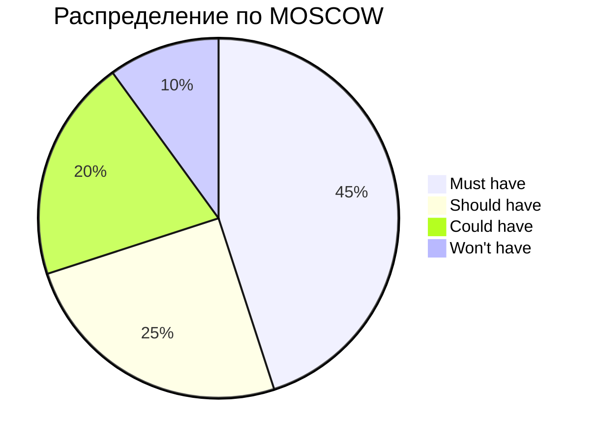

# Глава 2: Глубокое погружение в SMART и MOSCOW: Практическое руководство

## Введение в методологии целеполагания
SMART и MOSCOW - фундаментальные инструменты для управления требованиями и постановки целей. Освойте их применение на профессиональном уровне.

## Раздел 1: Расширенная методология SMART
### 1.1 Детальный разбор критериев
Каждый критерий SMART требует глубокого понимания:

**Specific (Конкретность):**
- Используйте формулу 5W:
  - What (Что нужно сделать?)
  - Why (Зачем это нужно?)
  - Who (Кто участвует?)
  - Where (Где будет выполняться?)
  - Which (Какие ресурсы/ограничения?)

**Измеримость на практике:**
- Количественные метрики:
  - Время выполнения (мс, сек)
  - Производительность (RPS, TPS)
  - Бизнес-метрики (конверсия, доход)
- Качественные показатели:
  - Удовлетворенность пользователей (NPS)
  - Улучшение UX (по результатам тестирования)

### 1.2 Сложные кейсы постановки целей
**Технический пример:**
```markdown
**Плохая цель:**
"Увеличить производительность API"

**SMART-цель:**
"Увеличить скорость обработки запросов /api/v1/payments
с текущих 1200 мс до 500 мс для 95-го перцентиля
к 30 ноября 2025 года,
измеряя с помощью Prometheus и Grafana"
```

**Управленческий пример:**
```markdown
**Плохая цель:**
"Улучшить процесс онбординга"

**SMART-цель:**
"Сократить время полной онбординга новичка
с 10 до 5 рабочих дней
и повысить удовлетворенность по опросу с 3.2 до 4.5 баллов
к концу Q1 2026 года"
```

### 1.3 Практикум: Трансформация целей
Преобразуйте цели в SMART-формат:
1. "Сделать систему надежнее"
2. "Улучшить командную работу"
3. "Оптимизировать процессы разработки"

## Раздел 2: MOSCOW как инструмент приоритизации
### 2.1 Продвинутые техники классификации
**Матрица Эйзенхауэра + MOSCOW:**
| Важность \ Срочность | Срочно      | Не срочно   |
|----------------------|-------------|-------------|
| **Важно**            | M (Сделать) | S (Запланировать) |
| **Не важно**         | C (Делегировать) | W (Исключить) |

**Количественная оценка:**
1. Присвойте каждой задаче баллы от 1 до 10 по:
   - Бизнес-ценность
   - Техническая сложность
   - Риски
2. Рассчитайте приоритет: Ценность / (Сложность * Риски)

### 2.2 Реальные кейсы приоритизации
**Ситуация:** Релиз мобильного приложения с ограниченными ресурсами

**Бэклог:**


**Решение:**
1. M: Основной поток покупок, безопасность
2. S: Push-уведомления, аналитика
3. C: Социальный шеринг, темная тема
4. W: AR-функционал (перенесено на v2)

### 2.3 Инструменты автоматизации
1. Jira Advanced Roadmaps
2. Aha! для визуализации
3. Custom-скрипты для пересчета приоритетов

## Раздел 3: Интеграция SMART и MOSCOW в Agile
### 3.1 Поэтапное внедрение
1. **Планирование квартала:**
   - Определение OKR через SMART
   - Распределение по квартальным целям
2. **Планирование спринта:**
   - Приоритизация задач через MOSCOW
   - Оценка SMART-целей для каждой задачи

### 3.2 Антипаттерны и решения
**Проблема:** "Проклятие переоцененных Could have"
**Решение:** Жесткий лимит - не более 20% спринта на Could have

**Проблема:** "Размытые Must have"
**Решение:** Чек-лист для Must have:
- Без задачи релиз невозможен
- Нарушает контрактные обязательства
- Критично для безопасности

## Комплексное упражнение
**Ситуация:** Команде нужно выпустить обновление SaaS-платформы за 3 месяца

**Данные:**
- 10 разработчиков
- Бэклог из 50 задач
- Технический долг: 20% времени

**Задание:**
1. Сформулируйте 3 SMART-цели для релиза
2. Проведите приоритизацию бэклога по MOSCOW
3. Составьте roadmap на 3 месяца
4. Рассчитайте риски и буферы