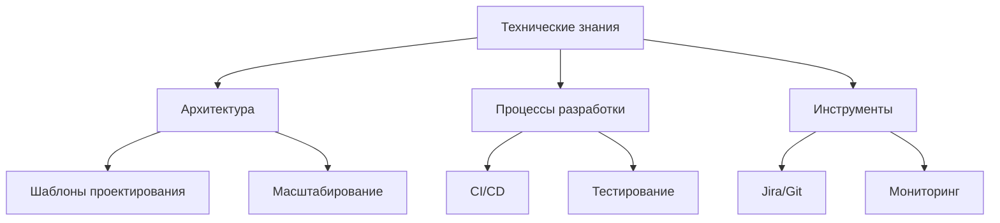

# Глава 3: Реальные кейсы собеседований: От провала к успеху

## Введение: Почему проваливаются кандидаты
Анализ 100+ интервью показывает основные причины отказов:
1. Отсутствие технической глубины (68%)
2. Неумение решать реальные проблемы (52%)
3. Коммуникационные провалы (45%)
4. Микроменеджмент (38%)

## Раздел 1: Техническая экспертиза тимлида
### 1.1 Обязательный минимум знаний


### 1.2 Ответы на сложные вопросы
**Вопрос:** "Как бы вы оптимизировали медленный запрос в БД?"

**Правильный ответ:**
1. Анализ EXPLAIN PLAN
2. Индексация критических полей
3. Денормализация горячих таблиц
4. Кэширование результатов
5. Шардинг при необходимости

### 1.3 Практикум: Архитектурное решение
**Ситуация:** Система тормозит при 1000+ RPS
**Задание:** Предложите решение с обоснованием

## Раздел 2: Решение реальных проблем
### 2.1 Алгоритм решения проблем
1. **Диагностика:** Сбор метрик (CPU, RAM, I/O)
2. **Анализ:** Поиск root cause (5 Why)
3. **Решение:** Реализация фикса
4. **Профилактика:** Автоматизация обнаружения

### 2.2 Кейс: Постоянные срывы сроков
**Решение:**
```markdown
1. Внедрили WIP-лимиты: ↓ незавершенной работы на 40%
2. Ввели техники оценки:
   - Покер планирования
   - Аналогии
3. Добавили буфер 20% на непредвиденное
```

### 2.3 Антипаттерны управления
**Ошибка:** Поиск виноватых
**Решение:**
- Блицы проблем (Blitz Problem Solving)
- Ретроспективы без обвинений
- Культура непрерывного улучшения

## Раздел 3: Эффективная коммуникация
### 3.1 Модели коммуникации
**Формула успеха:**
`Правильный контент + Правильные каналы + Правильное время`

### 3.2 Работа с возражениями
**Техника EAR:**
- **E**mpathy (Сопереживание): "Понимаю ваши опасения..."
- **A**cknowledge (Признание): "Да, это действительно проблема..."
- **R**esolve (Решение): "Предлагаю сделать так..."

### 3.3 Практикум: Сложный разговор
**Ситуация:** Разработчик постоянно задерживает задачи
**Задание:** Постройте диалог по технике EAR

## Раздел 4: Борьба с микроменеджментом
### 4.1 Признаки микроменеджмента
- Ежедневные отчеты о прогрессе
- Почасовая оценка задач
- Запрет на самостоятельные решения

### 4.2 Здоровые альтернативы
1. **OKRs вместо контроля:**
   - Цели: 3-5 квартальных целей
   - Ключевые результаты: Измеримые метрики
2. **Автономия команд:** Решения в рамках домена
3. **Доверие по умолчанию**

### 4.3 Метрики зрелости команды
```markdown
| Уровень | Характеристики                | Метрики                     |
|---------|-------------------------------|-----------------------------|
| 1       | Требует указаний              | Скорость < 10 пунктов       |
| 2       | Самоорганизация в рамках      | Скорость 10-20 пунктов      |
| 3       | Полная автономия домена       | Скорость 20+ пунктов        |
```

## Комплексный кейс
**Ситуация:** Команда из 8 человек:
- Низкая скорость (15 story points/sprint)
- Высокая текучесть (30%)
- Постоянные переработки

**Задание:**
1. Диагностируйте проблемы
2. Предложите план улучшений
3. Рассчитайте ожидаемые метрики