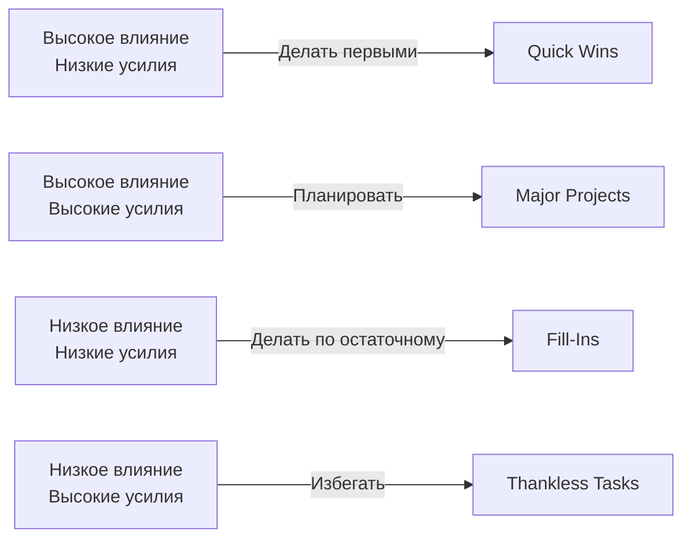

# Глава 4: Продвинутое управление стейкхолдерами: От конфликта к сотрудничеству

## Введение: Почему стейкхолдеры недовольны
Анализ 50+ кейсов показывает главные причины:
1. Невидимость прогресса (72%)
2. Разрыв ожиданий и реальности (65%)
3. Плохая коммуникация (58%)
4. Технические долги (45%)

## Раздел 1: Стратегии прозрачности
### 1.1 Система отчетности
**Элементы эффективного отчета:**
```markdown
1. **Прогресс:** Что сделано за период (+ метрики)
2. **Планы:** Что будет сделано в следующий период
3. **Риски:** Потенциальные проблемы и mitigation
4. **Метрики:**
   - Velocity (скорость команды)
   - Lead time (время от идеи до реализации)
   - Bug rate (количество багов на 1000 строк кода)
```

### 1.2 Инструменты визуализации
1. **Интерактивные дашборды:**
   - Grafana для технических метрик
   - Jira Dashboards для прогресса
2. **Автоматизированные отчеты:**
   - Confluence + Automation for Jira
   - Custom Slack-боты

### 1.3 Практикум: Создайте отчет
**Ситуация:** Отчет для продукт-менеджера о прогрессе за спринт
**Задание:** Подготовьте структуру отчета с реальными метриками

## Раздел 2: Приоритизация по-новому
### 2.1 Матрица влияния/усилий


### 2.2 Техника RICE
Оценка задач по:
- **R**each (Охват): Сколько пользователей затронет
- **I**mpact (Влияние): Эффект на каждого пользователя (0-3)
- **C**onfidence (Уверенность): % уверенности в оценке
- **E**ffort (Усилия): Человеко-дни

**Формула:** `(Reach * Impact * Confidence) / Effort`

### 2.3 Кейс: Приоритизация в кризисе
**Ситуация:** 3 стейкхолдера требуют срочных изменений
**Решение:**
1. Провели RICE-оценку всех требований
2. Наглядно показали приоритеты на матрице
3. Согласовали roadmap на квартал

## Раздел 3: Управление техническим долгом
### 3.1 Система оценки долга
**Метрика долга:**
`Техдолг = (Время на исправление багов) / (Общее время разработки) * 100%`

**Здоровый уровень:** 15-25%

### 3.2 Стратегия уменьшения долга
1. **Резервирование времени:** 30% спринта на техдолг
2. **Технические спринты:** Каждый 4-й спринт - только техдолг
3. **Автоматизация:** Статический анализ, автотесты

### 3.3 Практикум: Расчет техдолга
**Данные:**
- Время на баги: 40 часов
- Общее время разработки: 200 часов
**Задание:** Рассчитайте метрику техдолга и предложите план улучшений

## Раздел 4: Продвинутые коммуникационные техники
### 4.1 Модель переговоров Harvard
1. **Интересы, а не позиции:** "Вам нужны отчеты чаще? Почему?"
2. **Варианты взаимной выгоды:** "Можем дать raw data + аналитику"
3. **Объективные критерии:** "По SLA мы обязаны давать отчеты раз в 2 недели"

### 4.2 Работа с токсичными стейкхолдерами
**Тактика:**
- **Документирование:** Фиксация всех договоренностей
- **Эскалация:** Принцип "3 удара":
  1. Личная встреча
  2. Письмо с копией руководителю
  3. Официальная эскалация

## Комплексный кейс
**Ситуация:**
- Продукт: FinTech SaaS
- Стейкхолдеры: Продукт, Маркетинг, Юридический отдел
- Проблемы:
  - Запросы не согласованы
  - Постоянные срочные изменения
  - Техдолг 40%

**Задание:**
1. Разработайте систему коммуникации
2. Создайте процесс приоритизации
3. Постройте план снижения техдолга
4. Рассчитайте временные рамки улучшений